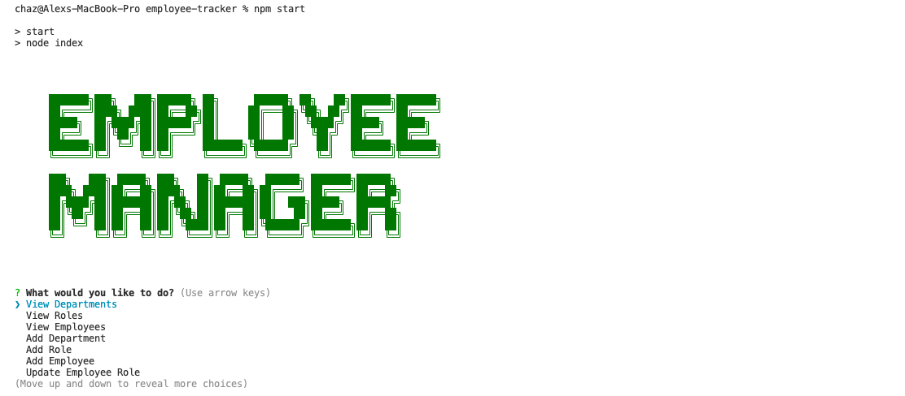

# Week12-Homework

# employee-tracker

## Description 

This is a simple Employee tracker app that lets anyone even with out any computer knowledge to Add, Remove, Update and Delete Employee information within a business. It uses the inquirer package to ask the user a bunch of questions to which there will be a response from the system resulting in a table listing to the console.

## Table of contents 

- [Resources](#resources) 
- [Screenshots](#screenshots) 
- [Contact](#contact)
- [Usage](#usage)
  
## Resources

> [Github Repo](https://github.com/mckayjalex/employee-tracker)

> [Walkthrough Video](https://youtu.be/-nWH-2qkbng)

## Screenshots 

Welcome Page

Googbye Page

## Usage

Run this below code inside your CLI (Terminal on Mac)

> npm install

Then run..

> npm start

## Contact

GitHub: [GitHub](https://github.com/mckayjalex) Email: [alexjosephmckay@gmail.com](alexjosephmckay@gmail.com)